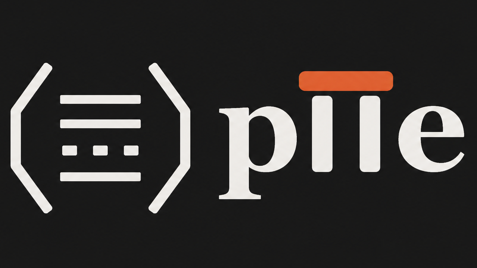

# piie

**piie is a privacy layer for AI applications.**

It detects personal information before it reaches your LLM prompts, logs, vector databases, analytics tools, or support workflows. When piie finds sensitive data, it can redact it, pseudonymize it, allow it, or block the request.

In plain English: piie helps your app avoid accidentally handing private user data to systems that should not see it.

---

## The Problem

Modern apps send huge amounts of text to AI systems. That text often contains personal information:

```text
"Please refund my order. My card is 4111-1111-1111-1111, phone is +91 98765 43210, and email is janvi@gmail.com."
```

In India, the same issue can show up in support chats, fintech workflows, edtech apps, delivery apps, health forms, and internal CRMs:

```text
"My UPI is janvi@oksbi. My PAN is ABCDE1234F. Please call me on +91 98765 43210."
```

Without a privacy layer, that data can quietly spread into places where it is hard to control:

- LLM provider logs
- Prompt debugging tools
- Fine-tuning datasets
- Vector databases
- Internal support dashboards
- Analytics pipelines
- Audit logs that accidentally become sensitive themselves

This is a real-world problem because users do not always know what counts as sensitive, and developers cannot manually review every prompt, webhook, chat message, or log line.

---

## How piie Fixes It

Put piie between your application and the systems that receive text.

```python
from piie import detect_and_sanitize

safe_text = detect_and_sanitize(
    "Refund my order. My card is 4111-1111-1111-1111, phone is +91 98765 43210, and email is janvi@gmail.com.",
    action="redact",
)

print(safe_text)
```

Output:

```text
Refund my order. My card is [CARD_REDACTED], phone is [PHONE_REDACTED], and email is [EMAIL_REDACTED].
```

The app still understands the request. The LLM does not receive the raw card number or email address.

---

## Key Features

- **PII detection for AI workflows**: Scan prompts, chat messages, JSON payloads, logs, and API requests.
- **Redaction**: Replace sensitive values with clear placeholders like `[EMAIL_REDACTED]`.
- **Pseudonymization**: Replace sensitive values with stable tokens so systems can correlate activity without seeing the real data.
- **Blocking mode**: Reject requests that contain disallowed PII types.
- **Risk scoring**: Estimate privacy risk based on the types of PII found.
- **JSON support**: Sanitize nested JSON while preserving structure.
- **FastAPI middleware**: Add privacy enforcement to API services.
- **Audit logging**: Record privacy decisions without storing raw PII.
- **Policy configuration**: Define which entity types should be redacted, pseudonymized, allowed, or blocked.
- **CLI and server modes**: Use it locally, in scripts, or as a small service.
- **Optional MCP support**: Expose privacy tools to MCP-compatible AI agents.

---

## Why piie Is Different

Many privacy tools are built for large enterprise data teams. They can be powerful, but they are often expensive, cloud-first, and slow to integrate.

piie is designed for developers building AI products now:

- It runs locally or inside your own infrastructure.
- It is small enough to understand and modify.
- It works as a library, CLI, API server, and middleware.
- It focuses on the path where leaks often happen: text entering AI systems.
- It avoids storing raw PII in transformation metadata.
- It gives useful outputs for engineering workflows: entity counts, confidence, positions, and risk scores.

piie is not trying to replace every enterprise DLP platform. It is trying to give AI builders a practical privacy layer they can add early, before sensitive data spreads everywhere.

---

## Why People Should Use It

Use piie if you are building:

- AI agents
- Chatbots
- RAG pipelines
- Customer support automation
- Internal copilots
- Log processing systems
- Prompt observability tools
- Data cleaning workflows
- APIs that receive user-generated text
- Indian fintech, healthtech, edtech, ecommerce, SaaS, and support tools that handle user messages

It helps you reduce privacy risk before data leaves your app boundary. That matters because once sensitive data gets into a third-party LLM, a vector database, or a debugging log, cleanup becomes much harder.

---

## What piie Detects

piie currently detects common high-risk PII patterns:

| Type | Example | Redacted Output |
| --- | --- | --- |
| Credit cards | `4111-1111-1111-1111` | `[CARD_REDACTED]` |
| SSNs | `123-45-6789` | `[SSN_REDACTED]` |
| Emails | `janvi@gmail.com` | `[EMAIL_REDACTED]` |
| Phone numbers | `+91 98765 43210` | `[PHONE_REDACTED]` |
| IP addresses | `192.168.1.1` | `[IP_REDACTED]` |
| Custom patterns | Aadhaar, PAN, UPI, employee IDs | `[REDACTED]` |

Credit cards are validated with Luhn checks to reduce false positives.

For India-specific identifiers such as Aadhaar numbers, PAN numbers, UPI IDs, voter IDs, or internal customer IDs, you can add custom regex patterns based on your app's needs.

Example:

```python
from piie import PIIDetector

detector = PIIDetector(custom_patterns={
    "PAN": r"\b[A-Z]{5}[0-9]{4}[A-Z]\b",
    "UPI": r"\b[a-zA-Z0-9.\-_]{2,256}@[a-zA-Z]{2,64}\b",
})

matches = detector.detect("PAN ABCDE1234F and UPI janvi@oksbi")
```

---

## What You Can Do With It

**Use it as a Python library**

```python
from piie import PIIDetector, PIISanitizer, SanitizationAction

text = "Contact me at janvi@gmail.com or +91 98765 43210"

detector = PIIDetector()
matches = detector.detect(text)

sanitizer = PIISanitizer()
result = sanitizer.sanitize(text, matches, SanitizationAction.REDACT)

print(result.sanitized)
```

**Use the simple helper**

```python
from piie import detect_and_sanitize

safe = detect_and_sanitize("Call me at +91 98765 43210")
```

**Use it from the CLI**

```bash
piisafe sanitize --text "Email janvi@gmail.com and phone +91 98765 43210"
```

**Run it as an API server**

```bash
piisafe serve
```

Then call:

```bash
curl http://localhost:8000/sanitize \
  -H "Content-Type: application/json" \
  -d '{"content": "Call me at +91 98765 43210"}'
```

Example response:

```json
{
  "original": "[REDACTED]",
  "sanitized": "Call me at [PHONE_REDACTED]",
  "entities_found": 1,
  "transformations": [
    {
      "entity_type": "PHONE",
      "value_hash": "PHONE_...",
      "confidence": 0.85,
      "position": "11-23"
    }
  ],
  "risk_score": 0.5
}
```

Notice that the API does not echo the raw PII back in the response.

---


## MCP Support

piie includes an optional Model Context Protocol server for AI tools that support MCP.

Install the extra:

```bash
pip install "piie[mcp]"
```

Example MCP configuration:

```json
{
  "mcpServers": {
    "piie": {
      "command": "python",
      "args": ["-m", "piie.mcp_server"]
    }
  }
}
```

---

## Production Notes

piie is useful today as an early privacy layer, but privacy is high-stakes software. Before relying on it in production:

- Run the test suite in your environment.
- Configure a stable `PSEUDONYMIZATION_SALT` if you use pseudonymization.
- Set `PII_SAFE_ENV=production`.
- Enable authentication with `AUTH_REQUIRED=true`.
- Review your policy configuration.
- Test against your real data formats.
- Treat piie as a privacy guardrail, not a full legal compliance guarantee.

---

## Install

```bash
pip install piie
```

For local development:

```bash
pip install -e ".[dev]"
pytest -q
```

---


